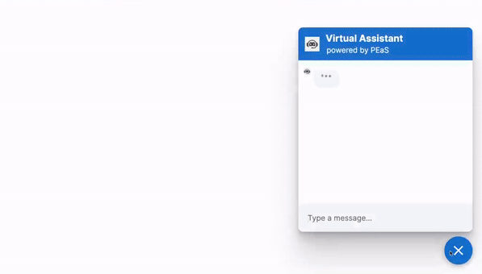

# ChatBot Response Generator

Welcome to the ChatBot Response Generator project! This open-source initiative aims to facilitate the creation of response generators for chatbots. Developers can define various types of responses and seamlessly integrate them into their chatbot applications.

## Tech/Framework Used

This project is built with Python, utilizing Flask for web development and the NLTK library for natural language processing.

## Screenshots and Demo

<div align="center">
  
</div>

## Getting Started

To begin working with this project, follow these simple steps:

1. **Clone the repository:**
   ```
   git clone https://github.com/Theternos/Medibot.git
   ```

2. **Install dependencies:**
   ```
   pip install -r requirements.txt
   ```

3. **Define Responses:**
   Edit the `responses.py` file to define your custom responses.

4. **Integrate with Rasa:**
   Import the `responses.py` module to integrate the generated responses into your Rasa chatbot.

5. **Train and Run:**
   Train your Rasa chatbot using the integrated responses and run it to start interacting with users.

## Contributing

Contributions to this project are highly encouraged! If you're interested in contributing, please follow these steps:

1. **Fork the repository.**
2. **Create a new branch:** `git checkout -b feature/new-feature`.
3. **Make your changes and commit them:** `git commit -am 'Add new feature'`.
4. **Push to the branch:** `git push origin feature/new-feature`.
5. **Create a new Pull Request.**

## Acknowledgements

Special thanks to Rasa for providing the framework for building conversational AI chatbots.

Feel free to customize this README file further to align with your project's specific details and requirements. If you have any questions or need assistance, don't hesitate to reach out!
